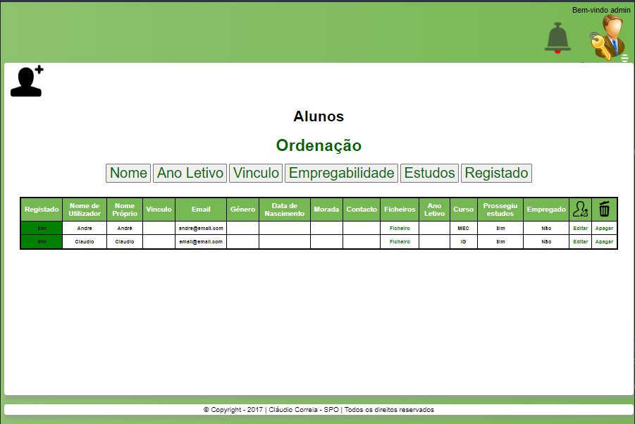

# PAP - Projeto de Aptidão profissional

Construção de uma plataforma web que permita a todos os utilizadores consultarem e disponibilizarem ofertas de emprego.

  
  Permitir ao administrador a gestão da informação prestada pelos alunos e pelas empresas;
  Possibilitar ao administrador a análise de dados (cálculo de estatísticas) para 
  posterior consulta e eventual divulgação;
  
  Permitir o acesso a informações de âmbito profissional e CV dos alunos por 
  parte do administrador e empresas, para contacto posterior;
  
  Permitir a obtenção de informação acerca do grau de satisfação dos empregadores.
  
  PHP, HTML , JAVASCRIPT, CSS, SQL; 
  
  
  
  
  
  

